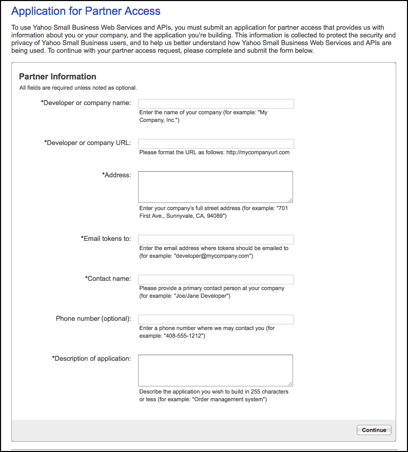

# Merchant Solutions API Documentation

## Order and Payment APIs Overview

Yahoo Merchant Solutions Order and Payment APIs are designed to open up the Store as a platform, to
provide merchants using external Order Management Systems (OMS) with customized order and
payment processing solutions. Previously, integration with an external OMS lacked enough API resources
for maintaining synchronous communication between order and payment processing systems. 

Order and Payment APIs are designed to satisfy this need, allowing you to maintain synchronous communication
between third-party order management systems and your Yahoo Store, to ensure that order information
is current in both systems. Order and Payment APIs also provide batch-processing capabilities, which
allow actions on multiple orders at the same time, rather than on a per-order basis.

## Order APIs

The Order API package includes sets of non-bulk APIs for order processing and custom order status
creation. Order APIs enable partners to update order information, retrieve order information, and to get
information about a range of orders. Custom Order Status operations enable new custom order statuses to
be created, and allow for updating and retrieving information about these statuses. Call responses for all
order processing APIs are synchronous in nature.

## Payment APIs

The Payment API package includes sets of both bulk and non-bulk APIs for payment processing and
transaction queries. As the APIs support FDMS and PayPal payment transactions, merchants are
required to have either FDMS-compatible or PayPal payment processors. Payment APIs neither add to
nor subtract from current payment processor functionality.

Non-bulk APIs support single transactions, with operations performed in synchronous mode. Bulk APIs
support multiple transactions, and use batch queues. Operations are performed in asynchronous mode.

# Security

## Data Security Prerequisites

Yahoo is committed to the security of store data. To ensure data security, all web service calls are to be
made over an HTTPS connection secured by 128-bit SSL v3, or a TLS connection. Please note that SSL
v2 is not supported or allowed.

## Authentication

Access to Order and Payment APIs must be restricted to authenticated and authorized partners only.
Each time a partner makes a call, they must be recognized as having valid access to do so. All web
service APIs that access a store’s data require a partner access token (contract token) to be included.

Should a contract token become compromised, the token may be revoked by the merchant or the partner.
Although a new token may be generated for the partner, it is the responsibility of the partner to protect their
tokens from being exposed to outside parties. Please see section 4 of the Getting Started Guide for more
information about partner tokens.

# Requirements

## Merchant Requirements

In order to use Order and Payment APIs, merchants must have a Yahoo Merchant Solutions Standard,
Professional, or Yahoo Store account, and be open for business. To use Payment APIs, merchants must
have either an FDMS-compatible or PayPal payment processor.

To find out more about setting up payment processing, please see:
* Merchant Account Application and Set Up
* Payment Processing – See How It Works
* Payment Processing Glossary

## Partner Requirements

Partners must apply and be approved for a Partner ID, in order for merchants to grant them Order and
Payment APIs access for their Yahoo Store. Partners must also be supplied with a partner access token for
each individual store they have been provisioned with API access to, in order to make web service calls.

To learn how to apply for a Partner ID, please see section 3.1. For information about partner access
tokens, please see section 4.

# Access to Order and Payment APIs

In order to make API calls, a user must have a Partner ID, and be added to a Yahoo store’s access list.
This is true of both partners who will make API calls on behalf of the merchant, and of merchants who
wish to make their own API calls.

## Partner IDs

All users must have a Partner ID, whether they are a partner or the store merchant. Partner IDs are
supplied by Yahoo upon approval of an Application for Partner Access.

To apply for a Partner ID:

1. Access https://apipartners.store.yahoo.com/.
2. Complete the Application for Partner Access form. This form requires the following information:
   * Yahoo ID
   * Developer or company name
   * Address
   * Email address where tokens should be sent
   * Contact name
   * Phone number (optional)
   * Description of application (e.g., order management system, or in the case of merchants,please note you are a merchant         who wishes to make your own Order and Payment API calls)
   
3. Submit the Application for Partner Access form. This application will be reviewed by Yahoo. Approved applicants will be        notified via email and sent a Partner ID.

   

Partners must provide Yahoo Store merchants whose stores they wish to make API calls for with their
Partner ID, so the merchant may add them to their store’s API access list.

## Adding a Partner ID to a Store’s API Access List

Once a merchant has been provided with a partner’s Partner ID, they may add this user to their store’s
API access list, which will grant the partner access to make API calls for their store. If the merchant
wishes to make their own API calls, they may add their own Partner ID to their store’s API access list.

1. In Store Manager, click the “Real-Time Links” link, located in the Order Settings column.
2. Click the “API Settings” link.
3. In the API Settings section, click the “Add New Partner” button.
4. Enter the Partner ID, then click “Next“.
5. Accept the Terms of Service.

Once the partner ID has been added, a partner access token will be generated and sent via email to the
user whose partner ID has been added.

# Tokens

When a Partner ID is added to a store’s API access list, the token generated is valid for a one-year
period. After a token has been generated, it may be managed by both merchants and partners.

## Token Renewals

When a token is coming up for expiry, either the merchant or the partner must renew this token, in order
for the partner to have continued access to make API calls for the store the token is associated with.

### Merchant Renews Partner Token

Merchants may renew partner tokens using the API Settings tool, located in the Real-Time Links section of
Store Manager. Once partner access is renewed, a new token will be generated for the partner. New token
information will be sent to the partner via email. Please note that the partner must begin using this new
token before the original partner token expires. Continuing to use the original partner token after its expiry
date will result in failed API calls.
 
1. In Store Manager, click the “Real-Time Links” link, located in the Order Settings column.
2. Click the “API Settings” link.
3. In the API Settings section, select the partner token you wish to renew, using the corresponding
   “Select” checkbox.
4. Click the “Renew Selected” button.A Renew Partner Token(s) dialogue box will open. Here, you can set a custom expiry date for the new token, using the calendar widget. Tokens may be set to expire a minimum of one day from the token renewal date, up to a maximum of five years from the token renewal date. If a custom expiry date is not selected, the token expiry date will be one year from the date of token renewal, default.
5. Click the “Renew” button.


   A new partner token will be generated, and appear in the token list marked as “New.” The original token
   will be marked as “Renewed.” New token information will be sent to the partner via email, and the
   merchant will be notified of the token renewal via email.
   
### Partner Renews Partner Token

Partners may renew their partner tokens using the Manage Partner Tokens tool.

1. Log in to the Manage Partner Tokens tool, at the following URL: https://apipartners.store.yahoo.com/. 
2. All active tokens are listed in the “Active Tokens” tab. Tokens expiring within the next 30 days are also listed in the “Expiring Tokens” tab. Select the token(s) you wish to renew using the corresponding “Select” checkbox.
3. Click the “Renew Selected” button.  A Renew Partner Token(s) dialogue box will open. Here, you can set a custom expiry date for the new token, using the calendar widget. Tokens may be set to expire a minimum of one day from the token renewal date, up to a maximum of five years from the token renewal date. If a custom expiry date is not selected, the token expiry date will be one year from the date of token renewal, by default.

4. Click the “Renew” button.

A partner token will be generated, and appear in the token list marked as “New.” The original token marked as “Renewed.” New token information will be sent to the partner via email, and the merchant will be notified of the token renewal via email.
   
## Revoking Tokens

Yahoo Merchant Solutions — Order and Payment APIs: Getting Started Guide (October 3, 2013) 7
For several reasons, both merchants and partners may wish to revoke partner access tokens. Common
reasons for revoking tokens include the partner no longer requiring access to make API calls for a store; a
token becoming compromised; or the desire to change a token expiry date after a new token has been
issued. Both the merchant and partner have the ability to revoke tokens.

## Merchant Revokes Partner Token

Merchants may revoke partner tokens using the API Settings Tool, located in the Real-Time Links section of
Store Manager.

1. In Store Manager, click the "Real-Time Links" link, located in the Order Settings column.
2. Click the "API Settings" link.
3. In the API Settings section, select the partner token you wish to revoke, using the corresponding
   "Select" checkbox.
4. Click the "Revoke Selected" button. You will be asked to confirm that you wish to revoke the
   selected token. Click the "Revoke" button.

Once a token is revoked, it may no longer be used to make API calls. If the partner whose token you have
revoked has more than one valid (non-expired) token associated with your store (for example, their
original token and the renewed token, and you've revoked the renewed token), and you no longer wish for
the partner to have API access for your store, it is recommended that any additional valid tokens for the
partner also be revoked.

## Partner Revokes Partner Token

Partners may revoke their partner tokens using the Manage Partner Tokens tool.

1. Log in to the Manage Partner Tokens tool, at the following URL:
   https://apipartners.store.yahoo.com/.
2. In the "Active Tokens" tab, select the token you wish to revoke using the corresponding "Select"
   checkbox.
3. Click the "Revoke Selected" button.
4. You will be asked to confirm that you wish to revoke the selected token. Click the "Revoke
   Token(s)" button.
   
## Token Expiry Dates

The original token generated for a partner is valid for one year. The expiry date for this token cannot be
edited. Should you wish to grant a partner API access for longer than one year, and do not wish to wait
until the original token is near expiry, you may renew the original token and set the expiry date for any
time up to 5 years from the date of token renewal.

When you renew a token, you may set a custom token expiry date at the time of renewal. If you do not
provide a custom expiry date, the default expiry date will be one year from the date of token renewal. This
date cannot be edited once a token has been renewed. Should you wish to set a different expiry date for
a partner access token, you may revoke the token, then renew the original token again and set the expiry date.

# Glossary

See also:

 ## Payment Processing Glossary

**Address Verification Service (AVS)**: With AVS, the billing address provided by the buyer during checkout
is validated against the billing address on file at the customer's card issuing bank or credit card
association. The AVS response is added to the authorization response.

**Asynchronous**: Asynchronous operations do not occur in real-time. Bulk APIs perform operations in
asynchronous mode, using batches.

**Batch**: A collection of transactions. Note: PayPal transactions are settled immediately, and do not use
batches.

**Batch ID**: The identification number assigned to each batch by the payment processor, after settlement.

**Card Verification Value (CVV)**: The three-digit code printed in the signature panel on the back of Visa/
MasterCard/Discover (a four digit code printed on the front for American Express).

**Partner Access Token (Contract Token)**: A partner access token is generated for a partner and sent to
them via email once a merchant has added the Partner ID to the API access list for their store. A valid
partner access token must be used in all web service calls made for the store.

**Partner ID**: A unique identifying code used to add partners to Yahoo Store API access lists. Partners
apply and be approved for a Partner ID in order to use Yahoo Merchant Solutions Web Services and
APIs, then supply this Partner ID to merchants. Without a valid partner ID, a merchant cannot add a
partner to their store’s API access list.

**REST**: Representational State Transfer (REST). REST operates on resource-oriented services. Order
and Payment APIs follow general REST style, but use POST methods.

**SSL**: SSL, or Secure Sockets Layer, is a protocol used for transmitting private data, which encrypts the
data sent. Order and Payment APIs support 128-bit SSL v3.

**Synchronous**: Synchronous operations occur in real time. Non-Bulk APIs perform operations in
synchronous mode.

# Contact Information
For technical inquiries, please contact Yahoo Customer Care.
Yahoo Merchant Solutions — Order and Payment APIs: Getting Started Guide 

# Other Resources

## APIs

* Order and Payment APIs: Reference Guide (section B of this document)
* Yahoo Developer Network

## Payment Processing

* Merchant Account Application and Set Up
* Payment Processing – See How It Works
* Payment Processing Glossary

## REST

* Representational State Transfer in the Wikipedia

# Order and Payment APIs

This document is intended as a reference guide to outline details of Order and Payment APIs.
Documentation for each API has been ordered by Non-Bulk and Bulk APIs, with information listed by
resource. The documentation for each resource includes the resource’s allowed verbs, URLs and
methods, request and response fields, sample XML, and error codes.

Please note: URLs provided in this document are case-sensitive and format-sensitive. Trailing slashes
(“/”) should not be added to the end of a URL unless otherwise indicated.

For additional information about Yahoo Merchant Solutions’ Order and Payment APIs, please see Section
A of this document: Order and Payment APIs: Getting Started. This section includes overviews, security
information, merchant and partner getting started information, and further resources you may wish to
consult.

## Common Elements

This section makes note of information common to Non-Bulk and Bulk APIs, respectively. For resourcespecific
information, please consult the resource documentation provided in sections of this guide.

  * Order API - No Bulk
  * Payment API - Non-Bulk
  * Payment API - Bulk

## Non-Bulk 

Non-Bulk APIs support single transactions, with operations performed in synchronous mode.

Request XML for each non-bulk resource has the following common structure, where the ResourceList
element encloses the resource being operated upon. The get, update, or create verbs can each be
used, depending upon the operation being performed

```shell
<?xml version="1.0" encoding="utf-8"?>
<ystorewsRequest>
<StoreID> yhst-1234567890 </StoreID>
<SecurityHeader>
<PartnerStoreContractToken>Value of the contract token</PartnerStoreContractToken>
</SecurityHeader>
<Version> 1.0 </Version>
<Verb> get/update/create </Verb>
<ResourceList>
</ResourceList>
</ystorewsRequest>
```

## Bulk

Bulk APIs work using batch queues, and are able to process multiple transactions. Operations are
performed in asynchronous mode.

Request XML for each bulk resource has the following common structure, where the ResourceList element
encloses the resource being operated upon. The get, update, or create verbs can each be used,
depending upon the operation being performed.

```xml
<?xml version="1.0" encoding="utf-8"?>
<ystorewsBulkRequest>
<StoreID> yhst-1234567890 </StoreID>
Yahoo Merchant Solutions — Order and Payment APIs: Reference Guide (October 3, 2013) 1
<SecurityHeader>
<PartnerStoreContractToken>Value of the contract token</PartnerStoreContractToken>
</SecurityHeader>
<Version> 1.0 </Version>
<Verb> get/update/create </Verb>
<ResourceList>
</ResourceList>
</ystorewsBulkRequest>
````

## Errors

**Global HTTP errors**:
The following list of HTTP error codes are returned by all APIs: 

* HTTP_OK
* HTTP_BAD_REQUEST
* HTTP_NOT_FOUND
* HTTP_INTERNAL_SERVER_ERROR
* HTTP_CREATED
* HTTP_SERVICE_UNAVAILABLE
* HTTP_GATEWAY_TIME_OUT
  
**Application error codes**:
The error codes and messages listed below are generic errors that may be returned by all APIs. Errors
specific to individual resources are provided in the resource documentation.

Error Code | Description
---------- | -----------
10001 | Please, provide a valid Verb.
10002 | This operation is not permitted.
10003 | There is no resource supplied for the request.
10004 | Order id not found in store.
10006 | Request exceeds the maximum number of concurrent requests allowed for store. Please, try again later.
10009 | Authorization required.
10010 | Access denied.
10500 | An Internal error has occurred.

# Order API - Non Bulk

All Order APIs operate in Non-Bulk mode, using the following resources and verbs:

Resource Name| Allowed Verb(s)
---------- | -----------
Order | get, update
OrderListQuery | get
CustomOrderStatus | create, update
CustomOrderStatusListQuery | get

The system defined status IDs listed below are exposed to Order API users:

Status ID | Status Description
---------- | -----------
0 | OK
1 | Fradulent
2 | Cancelled
3 | Returned
4 | On Hold
5 | Pending Review
6 | Partially Shipped
7 | Fully Shipped
8 | Tracked
16-112 | Custom Status ID

Error responses are returned using the following common structure:

Response field | Description
-------------- | ---------------
Error/Code | The numerical code assigned to the error
Error/Message| The error message corresponding to the error code, explaining the error that has occurred

> Sample error response for Non-Bulk API requests:

```xml
<?xml version="1.0" encoding="utf-8"?>
<ystorews:ystorewsResponse xmlns:ystorews="urn:yahoo:sbs:ystorews" >
<RequestID> RequestID-1190608113568493 </RequestID>
<ErrorResourceList>
<Error>
<Code> 10500 </Code>
<Message> Internal Error </Message>
</Error>
</ErrorResourceList>
</ystorews:ystorewsResponse>
```
## Order

The Update Order operation may currently be performed on the Order resource.

## Update Order

The Update Order operation is used to update desired information about a particular order. Currently,
only certain fields are supported for updates.

<aside class="notice">
Note about updating an order with status #'s 6, 7 or 8:

Users may not mark an order with any of the above statuses (6, 7 or 8) directly. Shipment information for
the order should instead be updated, which will then mark the order with any of these statuses.</aside>

<aside class="notice">
Note about updating an order with custom status:

Users wishing to mark an order with a custom status should first create a custom status using the
CustomOrderStatus operation. Once created, the custom status ID may be used to mark any number of
orders.</aside>

**Note for updating shipment information**:

Number of items in an order | Type of shipment update allowed
--------------------------- | --------------------------------
1 | CartShipmentInfo only
More than 1 | Either CartShipmentInfo or multiple ItemShipmentInfo(s). These should not coexist in a request.

**REST based URL**: https://<storeid>.order.store.yahooapis.com/V1/order
	
**Method**: POST

**Request fields**:


**Input**:

Request Field | Type | Cardinality | Valid Values | Description
------------- | ---- | ----------- | ------------ | ------------
Order/OrderID | String | Required | Valid order ID | Order number
Order/StatusList | XML element | Optional | N/A| Status with which to update an order
Order/CartShipmentInfo | XML element | Optional | N/A | Shipment information for the order as a whole
Order/ShipToInfo | String | Optional | Valid N/A| Self explanatory
Order/BillToInfo | XML element | Optional | N/A | Self explanatory
Order/PayPalReviewInfo | XML element | Not allowed in an update request | N/A | Information about PayPal Payment Review
Order/BuyerEmail | String | Optional | Valid email ID | Self explanatory
Order/ItemList | XML element | Optional | N/A | Shipment information on a per item basis
Order/CreationTime | String | Not allowed in an update request | N/A | Self explanatory
Order/OrderTotals | XML elements | Not allowed in an update request | N/A| Self explanatory
Order/Referer | String | Not allowed in an update request | N/A | Self explanatory
Order/MerchantNotes | String | Optionnal | Consult XSD | Adds the given note to the existing notes in the order
Order/EntryPoint | String | Not allowed in an update request | Valid order ID | Self explanatory
Order/BuyerComments | String | Not allowed in an update request | N/A | Self explanatory
Order/PaymentProcessor | String | Not allowed in an update request | N/A | Self explanatory
Order/Currency | String | Not allowed in an update request | N/A| Currency used (for example, USD)
Order/ShipMethod | String | Not allowed in an update request | N/A | Self explanatory

**StatusList**:

Request Field | Type | Cardinality | Valid Values | Description
------------- | ---- | ----------- | ------------ | ------------
Order/StatusList/OrderStatus | XML element | Required (only 1 in number) | N/A | Status with which to update an order (only one such element can be present in a request)


**OrderStatus**:

Request Field | Type | Cardinality | Valid Values | Description
------------- | ---- | ----------- | ------------ | ------------
Order/StatusList/OrderStatus/StatusID | String | Required | -5, 16-112 | Status with which to update an order
Order/StatusList/OrderStatus/Note | String | Required | Consult XSD  | Reason/Note for updating the order with this status

**CartShipmentInfo**:

Request Field | Type | Cardinality | Valid Values | Description
------------- | ---- | ----------- | ------------ | ------------
TrackingNumber | String | Required | Consult XSD | Self explanatory
Shipper | String | Required | ups, fedex, airborne, usps, dhl | Self explanatory
Ship/State| String | Required | “shipped”: to mark the order shipped. “clear” : to clear the shipment status. Any other string: to update order with custom ship status. | Self explanatory
EmailCustomer| Integer | Optionnal | true/false | Self explanatory

**ShipToInfo (at least one child should be present)**:

Request Field | Type | Cardinality | Valid Values | Description
------------- | ---- | ----------- | ------------ | ------------
GeneralInfo | XML element | Optional | N/A | General information (name, phone number, email address) of ship to customer
AddressInfo | XML element | Optional | N/A | Shipping address information

BillToInfo (at least one child should be present):

Request Field | Type | Cardinality | Valid Values | Description
------------- | ---- | ----------- | ------------ | ------------
GeneralInfo | XML element | Optional | N/A | General information (name, phone number, email address) of customer billed
AddressInfo | XML element | Optional | N/A | Billing address information

**GeneralInfo (at least one child should be present)**:

Request Field | Type | Cardinality | Valid Values | Description
------------- | ---- | ----------- | ------------ | ------------
FirstName | String | Optional | Consult XSD | Customer’s first name
LastName | String | Optional | Consult XSD | Customer’s last name
PhoneNumber | String | Optional | Consult XSD | Customer’s phone number
Company | String | Optional | Consult XSD | Customer's company
Email | String | Optional | Consult XSD | Customer’s email address

**AddressInfo (at least one child should be present)**:

Request Field | Type | Cardinality | Valid Values | Description
------------- | ---- | ----------- | ------------ | ------------
Address1 | String | Optional | Consult XSD | Customer’s street address
Address2 | String | Optional | Consult XSD | Customer’s street addres, second line
City | String | Optional | Consult XSD | City in which street address resides
Country | String | Optional | Consult XSD | Country in which city and street address reside
State | String | Optional | Consult XSD | State in which street address and city reside
Zip | String | Optional | Consult XSD | Zip code of provided address

**PayPalReviewInfo (at least one child should be present)**:

Request Field | Type | Cardinality | Valid Values | Description
------------- | ---- | ----------- | ------------ | ------------
PayPalReviewStatus | String | Optional | Under Review, OK to ship, DO
NOT ship | Status of PayPal Payment Review
SellerProtection | String | Optional | Ineligible, Eligible, PartiallyEligible | PayPal Seller Protection

**ItemList**:

Request Field | Type | Cardinality | Valid Values | Description
------------- | ---- | ----------- | ------------ | ------------
Item| XML element |  Required (1 or more) | N/A | Ordered item information

**Item**:

Request Field | Type | Cardinality | Valid Values | Description
------------- | ---- | ----------- | ------------ | ------------
LineNumber | String | Required | N/A | Item line number
ItemShipmentInfo | String | Required | N/A | Item shipment information
ItemID | String | Not allowed in an update request | N/A | Self explanatory
ItemCode | String | Not allowed in an update request | N/A | Self explanatory
Quantity | String | Not allowed in an update request | N/A | Self explanatory
UnitPrice | String | Not allowed in an update request | N/A | Self explanatory
Description | String | Not allowed in an update request | N/A | Self explanatory
URL | String | Not allowed in an update request | N/A | Product URL
Taxable | String | Not allowed in an update request | N/A | Indicates if item is subject to sales tax
ThumbnailURL | String | Not allowed in an update request | N/A | Product thumbnail image URL
SelectedOptionList | String | Not allowed in an update request | N/A | Self explanatory

**SelectedOptionList**:

Request Field | Type | Cardinality | Valid Values | Description
------------- | ---- | ----------- | ------------ | ------------
Option | XML element | Not allowed in an update request | Self-explanatory

**Option**:

Request Field | Type | Cardinality | Valid Values | Description
------------- | ---- | ----------- | ------------ | ------------
Name | String | Not allowed in an update request | N/A | Option name
Value | String | Not allowed in an update request | N/A | Option name
**ItemShipmentInfo**:

Request Field | Type | Cardinality | Valid Values | Description
------------- | ---- | ----------- | ------------ | ------------
TrackingNumber | String | Optional | Consult XSD | Shipment tracking number
Shipper  | String | Optional | ups, fedex, airborne, usps, dhl | Shipping provider
ShipState | String | Required | “shipped": to mark the order shipped. “clear” : to clear the shipment status.  Any other string: to update order with custom ship status | Status of shipment
EmailCustomer | String | Optional | true/false | Indicates customer email notification

**OrderTotals**:

Request Field | Type | Cardinality | Valid Values | Description
------------- | ---- | ----------- | ------------ | ------------
Subtotal| Floating point| Not allowed in an update request | N/A | Self explanatory
Shipping| Floating point| Not allowed in an update request | N/A | Total shipping cost
Tax| Floating point | Not allowed in an update request | N/A | Total cost of taxes applied
GiftWrap| Floating point | Not allowed in an update request | N/A | Gift wrap cost
Discount | Floating point | Not allowed in an update request | N/A | Discount total
Coupon | Floating point | Not allowed in an update request | N/A | Coupon total
GiftCertificate | Floating point | Not allowed in an update request | N/A | Gift certificate total
Credit | XML element | Not allowed in an update request | N/A | Total of credits
MiscAdjustmentList | XML element | Not allowed in an update request | N/A | Total of other cost adjustments
Total | Floating point | Not allowed in an update request | N/A |Total price buyer will pay

**MiscAdjustment**:

Request Field | Type | Cardinality | Valid Values | Description
------------- | ---- | ----------- | ------------ | ------------
Name | String | Not allowed in an update request | N/A | Name given to adjustment
Value | String | Required | N/A | Order number

**MiscAdjustmentList**:

Request Field | Type | Cardinality | Valid Values | Description
------------- | ---- | ----------- | ------------ | ------------
MiscAdjustment | XML Element | Not allowed in an update request | N/A | Adjustment to order total

> Sample request XML:
Case I: Update all information about an order — Update CartShipmentInfo:

```xml
<?xml version="1.0" encoding="utf-8"?>
<ystorewsRequest>
 <StoreID> yhst-1234567890 </StoreID>
 <SecurityHeader>
  <PartnerStoreContractToken> test </PartnerStoreContractToken>
   </SecurityHeader>
<Verb> update </Verb>
<Version> 1.0 </Version>
<ResourceList>
 <Order>
  <OrderID> 485 </OrderID>
<StatusList>
 <OrderStatus>
  <StatusID> 5 </StatusID
  <Note> This is test note </Note>
</OrderStatus>
</StatusList>
<CartShipmentInfo>
 <TrackingNumber> tn-12345678 </TrackingNumber>
 <Shipper> ups </Shipper>
 <ShipState> nostatus </ShipState>
 <EmailCustomer> true </EmailCustomer>
</CartShipmentInfo>
<ShipToInfo>
 <GeneralInfo>
 <FirstName> test-fname </FirstName>
 <LastName> test-lname </LastName>
 <PhoneNumber> 123-456-7890 </PhoneNumber>
 <Company> Yahoo </Company>
 <Email> test@test.com </Email>
</GeneralInfo>
<AddressInfo>
 <Address1> 701 First Avenue </Address1>
 <Address2> Apt 101 </Address2>
 <City> Cupertino </City>
 <Country> US </Country>
 <State> CA </State>
 <Zip> 95014</Zip>
</AddressInfo>
</ShipToInfo>
<BillToInfo>
 <GeneralInfo>
  <FirstName> test-fname </FirstName>
  <LastName> test-lname </LastName>
  <PhoneNumber> 456-789-1234 </PhoneNumber>
 <Company> Yahoo </Company>
<Email> test@test.com </Email>
</GeneralInfo>
<AddressInfo>
   <Address1> 701 First Avenue </Address1>
   <Address2> Something </Address2>
   <City> Sunnyvale </City>
   <Country> US </Country>
   <State> CA </State>
   <Zip> 95014</Zip>
    </AddressInfo>
   </BillToInfo>
   <BuyerEmail> test_shopper@test.com </BuyerEmail>
  </Order>
 </ResourceList>
</ystorewsRequest>
```

> Sample request XML:
Case II: Update shipment information on a per item basis.

```xml
<?xml version="1.0" encoding="utf-8"?>
<ystorewsRequest>
<StoreID> yhst-1234567890 </StoreID>
<SecurityHeader>
<PartnerStoreContractToken> test </PartnerStoreContractToken>
</SecurityHeader>
<Verb> update </Verb>
<Version> 1.0 </Version>
<ResourceList>
<Order>
<OrderID> 485 </OrderID>
<StatusList>
<OrderStatus>
<StatusID> 5 </StatusID
<Note> This is test note </Note>
</OrderStatus>
</StatusList>
<ShipToInfo>
<GeneralInfo>
<FirstName> test-fname </FirstName>
<LastName> test-lname </LastName>
<PhoneNumber> 123-456-7890 </PhoneNumber>
<Company> Yahoo </Company>
<Email> test@test.com </Email>
</GeneralInfo>
<AddressInfo>
<Address1> 701 First Avenue </Address1>
<Address2> Apt 101 </Address2>
<City> Cupertino </City>
<Country> US </Country>
<State> CA </State>
<Zip> 95014</Zip>
</AddressInfo>
</ShipToInfo>
<BillToInfo>
<GeneralInfo>
<FirstName> test-fname </FirstName>
<LastName> test-lname </LastName>
<PhoneNumber> 456-789-1234 </PhoneNumber>
<Company> Yahoo </Company>
<Email> test@test.com </Email>
</GeneralInfo>
<AddressInfo>
<Address1> 701 First Avenue </Address1>
<Address2> Something </Address2>
<City> Sunnyvale </City>
<Country> US </Country>
<State> CA </State>
<Zip> 95014</Zip>
</AddressInfo>
</BillToInfo>
<BuyerEmail> test_shopper@test.com </BuyerEmail>
<ItemList>
<Item>
<LineNumber> 0 </LineNumber>
<ItemShipmentInfo>
<TrackingNumber> 12345678 </TrackingNumber>
<Shipper> ups </Shipper>
<ShipState> nostatus </ShipState>
</ItemShipmentInfo>
</Item>
<Item>
<LineNumber> 1 </LineNumber>
<ItemShipmentInfo>
<TrackingNumber> 23456789 </TrackingNumber>
<Shipper> fedex </Shipper>
<ShipState> 1-2d </ShipState>
</ItemShipmentInfo>
</Item>
</ItemList>
</Order>
</ResourceList>
</ystorewsRequest>
```

> Sample response XML (Case I and Case II)

```xml
<ystorews:ystorewsResponse xmlns:ystorews="urn:yahoo:sbs:ystorews" >
 <RequestID> Test Request ID </RequestID>
 <ProcessingStatus> All OK </ProcessingStatus>
</ystorews:ystorewsResponse>
```

## Error Code

Error Code | Description
---------- | -----------
20002 | Itemized shipment request not allowed when number of items is 1.
20003 | Both itemized and non-itemized shipment requests cannot co-exist when number of items is greater than 1.
20007 | Inadequate number of fields for this request.
20009 | More than one status present in input.
20010 | Invalid ShipState value.
20011 | Invalid Shipper value.
20012 | Empty General Info Tag.
20013 | Empty Address Info Tag.
20014 | Empty Shipment Info Tag.
20015 | Empty ShipTo Info Tag.
20016 | Empty BillTo Info Tag.
20017 | Missing Note in order status Tag.
20018 | Invalid status ID supplied.
20019 | Direct shipment status updates not allowed. Update CartShipmentInfo or ItemShipmentInfo to affect shipment status updates.
20020 | At least one of the item numbers is greater than the total number of items in the order..
20023 | ItemShipmentInfo tag is missing in the request.
20024 | Update operation not supported for these fields. Please refer to reference manual.
20027 | Zero fields supplied for update.

## OrderListQuery

The OrderListQuery operation is used to retrieve information about a single order, or a range of orders.

## Get Order

This operation is used to retrieve information about a particular order. The information sought must
be specified in the ‘Include’ tag under ‘Filter’. Currently, only certain fields are supported.

**REST based URL:** https://<storeid>.order.store.yahooapis.com/V1/order
	
**Method**: POST

 **Request fields**:

Request Field | Type | Cardinality | Valid Values | Description
------------- | ---- | ----------- | ------------ | ------------
OrderListQuery/Filter/Field | String | Required (1 or more) | status, shipmentinfo, shiptoinfo, billtoinfo, buyeremail, customfields | The specific field that should be retrieved from this order.
OrderList/QueryParams/OrderID | String | Required | Valid order ID | Order number
 
> Response fields: Order XML element or error. For error responses, please refer to the common error structure noted
for section 2.


Sample request XML:

```xml

<?xml version="1.0" encoding="utf-8"?>
<ystorewsRequest>
 <StoreID> yhst-1234567890 </StoreID>
 <SecurityHeader>
 <PartnerStoreContractToken> test </PartnerStoreContractToken>
</SecurityHeader>
<Version> 1.0 </Version>
<Verb> get </Verb>
<ResourceList>
<OrderListQuery>
<Filter>
 <Include> all </Include>
</Filter>
<QueryParams>
<OrderID> 485 </OrderID>
 </QueryParams>
 </OrderListQuery>
</ResourceList>
</ystorewsRequest>
```

> Sample response XML:

Note: The sample responses below include a Promotions element to support the Promotions
Center feature. This element and the information it contains are present only for orders in which
promotions have been applied.

Case I: An order contains only one item OR an order contains multiple items but was not split shipped prior to issuing the request, and includes promotions

```xml

<?xml version="1.0" encoding="utf-8"?>
<ystorews:ystorewsResponse xmlns:ystorews="urn:yahoo:sbs:ystorews" >
<Version> 1.0 </Version>
<RequestID> RequestID-1190608954601782 </RequestID>
<ResponseResourceList>
<OrderListQuery>
<Order>
<OrderID> 485 </OrderID>
<CreationTime> Wed Aug 15 00:50:09 2007 GMT </CreationTime>
<StatusList>
<OrderStatus>
<StatusID> 26 </StatusID>
</OrderStatus>
<OrderStatus>
<StatusID> 8 </StatusID>
</OrderStatus>
</StatusList>
<ShipMethod> Air (3-5 days) </ShipMethod>
<CartShipmentInfo>
<ShipState> 1-2d </ShipState>
<TrackingNumber> tn-12345678 </TrackingNumber>
<Shipper> ups </Shipper>
</CartShipmentInfo>
<ShipToInfo>
<GeneralInfo>
<FirstName> test-fname </FirstName>
<LastName> test-lname </LastName>
<PhoneNumber> 123-456-7890 </PhoneNumber>
<Company> Yahoo </Company>
<Email>test@test.com </Email>
</GeneralInfo>
<AddressInfo>
<Address1> 701 First Avenue </Address1>
<Address2> Apt G111 </Address2>
<City> Sunnyvale </City>
<Country> US </Country>
<State> CA </State>
<Zip> 95014 </Zip>
</AddressInfo>
</ShipToInfo>
<BillToInfo>
<GeneralInfo>
<FirstName> bill-test </FirstName>
<LastName> bill-test </LastName>
<PhoneNumber> 555-555-1212 </PhoneNumber>
<Company> Yahoo </Company>
<Email> bill@test.com </Email>
</GeneralInfo>
<AddressInfo>
<Address1> 701 First Avenue </Address1>
<Address2> Something </Address2>
<City> Sunnyvale </City>
<Country> US </Country>
<State> CA </State>
<Zip> 95014 </Zip>
</AddressInfo>
</BillToInfo>
<BuyerEmail> test@test.com </BuyerEmail>
<CustomFieldsList>
<CustomField>
<Key>customkey1</Key>
<Value>Mycustomvalue1</Value>
</CustomField>
<CustomFieldsList>
<ItemList>
<Item>
<LineNumber> 0 </LineNumber>
<ItemID> item1 </ItemID>
<ItemCode> item1 </ItemCode>
<Quantity> 1 </Quantity>
<UnitPrice> 11 </UnitPrice>
<Description> item1 </Description>
<URL> http://v3test-46.stores.yahoo.net/item1.html </URL>
<Taxable> true </Taxable>
<ThumbnailURL> http://v3test-46.stores.yahoo.net/item1.html </ThumbnailURL>
</Item>
</ItemList>
<OrderTotals>
<Subtotal>11.01</Subtotal>
<Shipping>0.00</Shipping>
<Tax>0.00</Tax>
<Promotions>
<AppliedPromotion>
<Id>2</Id>
<Name>MyPromotion</Name>
<Type>PERCENTAGE</Type>
<Discount>0.10</Discount>
<Message>10.00% off</Message>
</AppliedPromotion>
</Promotions>
<Total>10.91</Total>
</OrderTotals>
<Referer> http://www.yahoo.com </Referer>
<MerchantNotes>
> 2007 Aug 22 03:16: Marked OK; reason given: test-note-0
> 2007 Aug 22 03:17: Marked Fraudulent; reason given: test-note-1
</MerchantNotes>
<EntryPoint> http://www.yahoo.com </EntryPoint>
<BuyerComments> Test Comments </BuyerComments>
<PaymentProcessor> PayPal </PaymentProcessor>
<Currency> USD </Currency>
<GiftMessage>test gift message</GiftMessage>
<PaymentType>PayPal</PaymentType>
<LastUpdatedTime>Tue Sep 10 09:33:14 2013 GMT</LastUpdatedTime>
<BuyerIP>203.83.248.37</BuyerIP>
</Order>
</OrderListQuery>
</ResponseResourceList>
</ystorews:ystorewsResponse>
```

> Case II: An order contains multiple items and promotions, and its shipment information
was updated on a per item basis prior to issuing the request.

```xml
<?xml version="1.0" encoding="utf-8"?>
<ystorewsResponse >
<Version>1.0</Version>
<RequestID> RequestID-1190608954601782 </RequestID>
<ResponseResourceList>
<OrderListQuery>
<Order>
<OrderID> 485 </OrderID>
<CreationTime> Wed Aug 15 00:50:09 2007 GMT </CreationTime>
<StatusList>
<OrderStatus>
<StatusID> 26 </StatusID>
</OrderStatus>
<OrderStatus>
<StatusID> 8 </StatusID>
</OrderStatus>
</StatusList>
<ShipMethod> Air (3-5 days) </ShipMethod>
<CartShipmentInfo>
<ShipState> 1-2d </ShipState>
<ItemList>
<Item>
<LineNumber> 0 </LineNumber>
<ItemID> item1 </ItemID>
<ItemCode> item1 </ItemCode>
<Quantity> 1 </Quantity>
<UnitPrice> 11 </UnitPrice>
<Description> item1 </Description>
<URL> http://v3test-46.stores.yahoo.net/item1.html </URL>
<Taxable> true </Taxable>
<ThumbnailURL> http://v3test-46.stores.yahoo.net/item1.html </ThumbnailURL>
<ItemShipmentInfo>
<TrackingNumber> 12345678 </TrackingNumber>
<Shipper> ups </Shipper>
<ShipState> some status </ShipState>
</ItemShipmentInfo>
</Item>
<Item>
<LineNumber> 1 </LineNumber>
<ItemID> item1 </ItemID>
<ItemCode> item1 </ItemCode>
<Quantity> 1 </Quantity>
<UnitPrice> 11 </UnitPrice>
<Description> item1 </Description>
<URL> http://v3test-46.stores.yahoo.net/item1.html </URL>
<Taxable> true </Taxable>
<ThumbnailURL> http://v3test-46.stores.yahoo.net/item1.html </ThumbnailURL>
<ItemShipmentInfo>
<TrackingNumber> 12345678 </TrackingNumber>
<Shipper> ups </Shipper>
<ShipState> some status </ShipState>
</ItemShipmentInfo>
</Item>
</ItemList>
<OrderTotals>
<Subtotal>11.01</Subtotal>
<Shipping>0.00</Shipping>
<Tax>0.00</Tax>
<Promotions>
<AppliedPromotion>
<Id>2</Id>
<Name>MyPromotion</Name>
<Type>PERCENTAGE</Type>
<Discount>0.10</Discount>
<Message>10.00% off</Message>
</AppliedPromotion>
</Promotions>
<Total>10.91</Total>
</OrderTotals>
<Referer> http://www.yahoo.com </Referer>
<MerchantNotes>
> 2007 Aug 22 03:16: Marked OK; reason given: test-note-0
> 2007 Aug 22 03:17: Marked Fraudulent; reason given: test-note-1
</MerchantNotes>
<EntryPoint> http://www.yahoo.com </EntryPoint>
<BuyerComments> Test Comments </BuyerComments>
<PaymentProcessor> PayPal </PaymentProcessor>
<Currency> USD </Currency>
<GiftMessage>test gift message</GiftMessage>
<PaymentType>PayPal</PaymentType>
<LastUpdatedTime>Tue Sep 10 09:33:14 2013 GMT</LastUpdatedTime>
<BuyerIP>203.83.248.37</BuyerIP>
</Order>
</OrderListQuery>
</ResponseResourceList>
</ystorewsResponse>
```

> Case III: An order is placed that comes under PayPal Payment Review and includes
promotions

```xml
<?xml version="1.0" encoding="utf-8"?>
<ystorews:ystorewsResponse xmlns:ystorews="urn:yahoo:sbs:ystorews" >
<Version> 1.0 </Version>
<RequestID> RequestID-1190608954601782 </RequestID>
<ResponseResourceList>
<OrderListQuery>
<Order>
<OrderID> 485 </OrderID>
<CreationTime> Wed Aug 15 00:50:09 2007 GMT </CreationTime>
<StatusList>
<OrderStatus>
<StatusID> 5 </StatusID>
</OrderStatus>
</StatusList>
<ShipMethod> Air (3-5 days) </ShipMethod>
<CartShipmentInfo>
<ShipState> 1-2d </ShipState>
<TrackingNumber> tn-12345678 </TrackingNumber>
<Shipper> ups </Shipper>
</CartShipmentInfo>
<ShipToInfo>
<GeneralInfo>
<FirstName> test-fname </FirstName>
<LastName> test-lname </LastName>
<PhoneNumber> 123-456-7890 </PhoneNumber>
<Company> Yahoo </Company>
<Email>test@test.com </Email>
</GeneralInfo>
<AddressInfo>
<Address1> 701 First Avenue </Address1>
<Address2> Apt G111 </Address2>
<City> Sunnyvale </City>
<Country> US </Country>
<State> CA </State>
<Zip> 95014 </Zip>
</AddressInfo>
</ShipToInfo>
<BillToInfo>
<GeneralInfo>
<FirstName> bill-test </FirstName>
<LastName> bill-test </LastName>
<PhoneNumber> 555-555-1212 </PhoneNumber>
<Company> Yahoo </Company>
<Email> bill@test.com </Email>
</GeneralInfo>
<AddressInfo>
<Address1> 701 First Avenue </Address1>
<Address2> Something </Address2>
<City> Sunnyvale </City>
<Country> US </Country>
<State> CA </State>
<Zip> 95014 </Zip>
</AddressInfo>
</BillToInfo>
<PayPalReviewInfo>
<PayPalReviewStatus> Under Review </PayPalReviewStatus>
<SellerProtection> Ineligible </SellerProtection>
</PayPalReviewInfo>
<BuyerEmail> test@test.com </BuyerEmail>
<CustomFieldsList>
<TrackingNumber> tn-12345678 </TrackingNumber>
<Shipper> ups </Shipper>
</CartShipmentInfo>
<ShipToInfo>
<GeneralInfo>
<FirstName> test-fname </FirstName>
<LastName> test-lname </LastName>
<PhoneNumber> 555-555-1212 </PhoneNumber>
<Company> Yahoo </Company>
<Email> test@test.com </Email>
</GeneralInfo>
<AddressInfo>
<Address1> 701 First Avenue </Address1>
<Address2> Apt G111 </Address2>
<City> Sunnyvale </City>
<Country> US </Country>
<State> CA </State>
<Zip> 95014 </Zip>
</AddressInfo>
</ShipToInfo>
<BillToInfo>
<GeneralInfo>
<FirstName> bill-test </FirstName>
<LastName> bill-test </LastName>
<PhoneNumber> 555-555-1212 </PhoneNumber>
<Company> Yahoo </Company>
<Email> bill@test.com </Email>
</GeneralInfo>
<AddressInfo>
<Address1> 701 First Avenue </Address1>
<Address2> Something </Address2>
<City> Sunnyvale </City>
<Country> US </Country>
<State> CA </State>
<Zip> 95014 </Zip>
</AddressInfo>
</BillToInfo>
<BuyerEmail> test@test.com </BuyerEmail>
<CustomFieldsList>
<CustomField>
<Key>customkey1</Key>
<Value>Mycustomvalue1</Value>
</CustomField>
<CustomFieldsList>
<CustomField>
<Key>customkey1</Key>
<Value>Mycustomvalue1</Value>
</CustomField>
<CustomFieldsList>
<ItemList>
<Item>
<LineNumber> 0 </LineNumber>
<ItemID> item1 </ItemID>
<ItemCode> item1 </ItemCode>
<Quantity> 1 </Quantity>
<UnitPrice> 11 </UnitPrice>
<Description> item1 </Description>
<URL> http://v3test-46.stores.yahoo.net/item1.html </URL>
<Taxable> true </Taxable>
<ThumbnailURL> http://v3test-46.stores.yahoo.net/item1.html </ThumbnailURL>
</Item>
</ItemList>
<OrderTotals>
<Subtotal>11.01</Subtotal>
<Shipping>0.00</Shipping>
<Tax>0.00</Tax>
<Promotions>
<AppliedPromotion>
<Id>2</Id>
<Name>MyPromotion</Name>
<Type>PERCENTAGE</Type>
<Discount>0.10</Discount>
<Message>10.00% off</Message>
</AppliedPromotion>
</Promotions>
<Total>10.91</Total>
</OrderTotals>
<Referer> http://www.yahoo.com </Referer>
<MerchantNotes></MerchantNotes>
<EntryPoint> http://www.yahoo.com </EntryPoint>
<BuyerComments> Test Comments </BuyerComments>
<PaymentProcessor> PayPal </PaymentProcessor>
<Currency> USD </Currency>
<GiftMessage>test gift message</GiftMessage>
<PaymentType>PayPal</PaymentType>
<LastUpdatedTime>Tue Sep 10 09:33:14 2013 GMT</LastUpdatedTime>
<BuyerIP>203.83.248.37</BuyerIP>
</Order>
</OrderListQuery>
</ResponseResourceList>
</ystorews:ystorewsResponse>
```

## Get Range
			
The IntervalRange and Counted Range operations are used to retrieve information about a range
of orders. The information to be retrieved for these orders can be specified in the ‘Include’ tag
under ‘Field’.

**Note**: Currently, the response data returned may not exceed 100 KB. Up to a maximum of 100
orders can be returned, as long as the response data does not exceed this 100 KB limit.
REST based URL: https://<storeid>.order.store.yahooapis.com/V1/order

**Method**: POST

## GetIntervalRange

The GetIntervalRange operation allows information about a range of orders to be retrieved, by specifying
a starting order ID and ending order ID interval to return.

**Request fields**:
**Input**:

Request Field | Type | Cardinality | Valid Values | Description
------------- | ---- | ----------- | ------------ | ------------
OrderListQuery/Filter/Include| String| Required (1 or more) | all, status, shipmentinfo, shiptoinfo, billtoinfo, buyeremail, ordertotals | The specific field requested for each order in the range specified
OrderListQuery/QueryParams/IntervalRange/Start| Integer| Required | N/A | Start range number
OrderListQuery/QueryParams/IntervalRange/End | Integer | Required | N/A | End range number

**Request fields**:

Response field | Description
---------- | -----------
OrderID | Unique order number (identification value)
RequestID | Unique request identification code
BuyerEmail | Customer’s email address

For error responses, please refer to the common error structure noted for section 2.

> Sample request XML:

```xml
<?xml version="1.0" encoding="utf-8"?>
<ystorewsRequest>
<StoreID> yhst-1234567890 </StoreID>
<SecurityHeader>
<PartnerStoreContractToken> test </PartnerStoreContractToken>
</SecurityHeader>
<Version> 1.0 </Version>
<Verb> get </Verb>
<ResourceList>
<OrderListQuery>
<Filter>
<Include> buyeremail </Include>
</Filter>
<QueryParams>
<IntervalRange>
<Start> 485 </Start>
<End> 486 </End>
</IntervalRange>
</QueryParams>
</OrderListQuery>
</ResourceList>
</ystorewsRequest>
```

> Sample response XML:

```xml
<?xml version="1.0" encoding="utf-8"?>
<ystorews:ystorewsResponse xmlns:ystorews="urn:yahoo:sbs:ystorews" >
<RequestID> Test Request ID </RequestID>
<ResponseResourceList>
<Order>
<OrderID> 485 </OrderID>
<BuyerEmail> test_shopper@test.com </BuyerEmail>
</Order>
<Order>
<OrderID> 486 </OrderID>
<BuyerEmail> test_shopper@test.com </BuyerEmail>
</Order>
</ResponseResourceList>
</ystorews:ystorewsResponse>
```

## GetCountedRange
The GetCountedRange operation allows information about a range of orders to be retrieved, using
a starting order ID and specifying the number of orders following this starting order to return.

**Request fields**:
**Input**:

Request Field | Type | Cardinality | Valid Values | Description
------------- | ---- | ----------- | ------------ | -----------------------------------
OrderListQuery/Filter/Field| String| Required (1 or more) | all, status, shipmentinfo, shiptoinfo, billtoinfo, buyeremail, ordertotals | The specific field requested for each order in the range specified
OrderListQuery/QueryParams/CountedRange/Start| Integer| Required | N/A | Start range number
OrderListQuery/QueryParams/IntervalRange/Count| Integer | Required | N/A | Number of orders required starting from Start order number

**Request fields**:

Response field | Description
---------- | -----------
OrderID | Unique order number (identification value)
BuyerEmail | Customer’s email address
RequestID | Unique request identification code
Error/Code | If an error response is returned, this is the numerical code assigned to the Errors
Error Message | If an error response is returned, this error message corresponding to the error code, explaining the error that has occurred

For error responses, please refer to the common error structure noted for section 2.

> Sample request XML:

```xml
<?xml version="1.0" encoding="utf-8"?>
<ystorewsRequest>
<StoreID> demo-store </StoreID>
<SecurityHeader>
<PartnerStoreContractToken> wscert </PartnerStoreContractToken>
</SecurityHeader>
<Version> 1.0 </Version>
<Verb> get </Verb>
<ResourceList>
<OrderListQuery>
<Filter>
<Include> buyeremail </Include>
</Filter>
<QueryParams>
<CountedRange>
<Start> 485 </Start>
<Count> 2 </Count>
</CountedRange>
</QueryParams>
</OrderListQuery>
</ResourceList>
</ystorewsRequest>
```

> Sample response XML:

```xml
<ystorews:ystorewsResponse xmlns:ystorews="urn:yahoo:sbs:ystorews" >
<Version>
1.0
</Version>
<RequestID>
Test Request ID
</RequestID>
<ResponseResourceList>
<OrderListQuery>
<Order>
<OrderID>
485
</OrderID>
<BuyerEmail>
test@test.com
</BuyerEmail>
</Order>
<Order>
<OrderID>
486
</OrderID>
<BuyerEmail>
test@test.com
</BuyerEmail>
</Order>
</OrderListQuery>
</ResponseResourceList>
</ystorews:ystorewsResponse>
```

## Error Codes

Error Code | Description
---------- | -----------
20001 | Invalid range specified.
20004 | Mandatory Filter tag absent or empty.
20005 | Mandatory Include tag absent or empty.
20006 | Mandatory QueryParams tag absent or empty.
20008 | Invalid Include name in input.
20021 | Invalid Start Range specified.
20022 | Count specified in request is greater than that supported.
20025 | Invalid count in range query.
20026 | Invalid End Range specified.
20028 | Start range cannot be greater than End range.

## CustomOrderStatus
Operations performed on the CustomOrderStatus resource enable new custom order statuses to be
created, and provide the capacity to get and update custom status information.

## Create New Custom Status
The Create New Custom Status operation allows a partner to create a new custom order status that may
be assigned to an order.

**REST based URL**: https://<storeid>.order.store.yahooapis.com/V1/customorderstatus
**Method**: POST

**Request fields**:
Input:

Request Field | Type | Cardinality | Valid Values | Description
------------- | ---- | ----------- | ------------ | ------------
CustomOrderStatus/Code | String | Required | Consult XSD | Self explanatory
CustomOrderStatus/MsgToBuyer | String | Required | Consult XSD | Message displayed to buyer when an order is marked with a custom status
CustomOrderStatus/IncludeInStats | Integer| Required | true/false | When its value istrue, an order that is marked with this status is included in stats; if value is false, it is not included in stats
CustomOrderStatus/InUse | Integer | Required | true/false | When its value is true, an order can be marked with this status; if value is false, it cannot be marked with this status

**Request fields**:

Response field | Description
---------- | -----------
StatusID | Status identification number
Error/Code | If an error response, the numerical code assigned to the Error
Error Message | If an error response, the corresponding message explaining the error that has occurred

For error responses, please refer to the common error structure noted for section 2.

> Sample request XML:

```xml
<?xml version="1.0" encoding="utf-8"?>
<ystorewsRequest>
<StoreID> yhst-1234567890 </StoreID>
<SecurityHeader>
<PartnerStoreContractToken> test </PartnerStoreContractToken>
</SecurityHeader>
<Version> 1.0 </Version>
<Verb> create </Verb>
<ResourceList>
<CustomOrderStatus>
<Code> TestStatusCode </Code>
<MsgToBuyer> This is test msg. </MsgToBuyer>
<IncludeInStats> true </IncludeInStats>
<InUse> true </InUse>
</CustomOrderStatus>
</ResourceList>
</ystorewsRequest>
```

> Sample response XML:

```xml
<?xml version="1.0" encoding="utf-8"?>
<ystorews:ystorewsResponse xmlns:ystorews="urn:yahoo:sbs:ystorews" >
<RequestID> Test Request ID </RequestID>
<ResponseResourceList>
<Order>
<OrderID> 485 </OrderID>
<BuyerEmail> test_shopper@test.com </BuyerEmail>
</Order>
<Order>
<OrderID> 486 </OrderID>
<BuyerEmail> test_shopper@test.com </BuyerEmail>
</Order>
</ResponseResourceList>
</ystorews:ystorewsResponse>
```

## Update Custom Status

The Update Custom Status operation enables a previously-created custom order status to be updated.

**REST based URL**: https://<storeid>.order.store.yahooapis.com/V1/customorderstatus

**Method**: POST

**Request fields**:


Request Field | Type | Cardinality | Valid Values | Description
------------- | ---- | ----------- | ------------ | ------------
CustomOrderStatus/StatusID | Integer | Required | Consult XSD | Self explanatory
CustomOrderStatus/Code | String | Optional | Consult XSD | Status code
CustomOrderStatus/MsgToBuyer | String | Optionnal | N/A | Message displayed to buyer when an order is marked with a custom status
CustomOrderStatus/IncludedinStats | Boolean | Optionnal | true/false | When its value is 1, an order that is marked with this status is included in stats; if value is 0, it is not included in stats
CustomOrderStatus/InUse | String | Boolean | Optionnal | true/false | When its value is 1, an order can be marked with this status; if value is not 1, it cannot be marked with this status

**Request fields**:

Response field | Description
---------- | -----------
RequestID | Unique request identification code
ProcessingStatus | Order processing status

For error responses, please refer to the common error structure noted for section 2.

> Sample request XML:

```xml
<?xml version="1.0" encoding="utf-8"?>
<ystorewsRequest>
<StoreID> yhst-1234567890 </StoreID>
<SecurityHeader>
<PartnerStoreContractToken> test </PartnerStoreContractToken>
</SecurityHeader>
<Version> 1.0 </Version>
<Verb> update </Verb>
<ResourceList>
<CustomOrderStatus>
<StatusID> 16 </StatusID>
<Code> TestStatusCode </Code>
<MsgToBuyer> This is test msg. </MsgToBuyer>
<IncludeInStats> true </IncludeInStats>
<InUse> true </InUse>
</CustomOrderStatus>
</ResourceList>
</ystorewsRequest>
```
> Sample response XML:

```xml
<ystorews:ystorewsResponse xmlns:ystorews="urn:yahoo:sbs:ystorews" >
<RequestID> Test Request ID </RequestID>
<ProcessingStatus> All OK </ProcessingStatus>
</ystorews:ystorewsResponse>
```
## Error Codes

Error Code | Description
---------- | -----------
30002 | Reached maximum number of custom order statuses; Cannot add any more.
30003 | Failed to add custom order status because of an internal error.
30004 | No custom order status has been added.
30005 | Zero fields supplied for update.
30007 | Status ID must be present in an update request.
30008 | Status ID must not be present in a create request.
30009 | Illegal custom status ID supplied in request.

## CustomOrderStatusListQuery
## GetCustomStatus
The GetCustomStatus operation is used to retrieve information about a previously-created custom
order status.

**REST based URL**: https://<storeid>.order.store.yahooapis.com/V1/customorderstatus

**Method**: POST

**Request fields**:

Request Field | Type | Cardinality | Valid Values | Description
------------- | ---- | ----------- | ------------ | ------------
CustomOrderStatus/StatusID | Integer | Required | Consult XSD | Self explanatory

**Request fields**:

Response field | Description
---------- | -----------
RequestID | Request identification code
StatusID | Status identification number
Code | Status code
MsgToBuyer | Message displayed to buyer when an order is marked with a custom status
IncludeInStats | When its value is 1, an order that is marked with this status is included in stats; if value is not 1, it cannot be marked with this status
InUse | When its value is 1, an order can be marked with this status; if value is not 1, it cannot be marked with this status

For error responses, please refer to the common error structure noted for section 2.

> Sample request XML:

```xml
<?xml version="1.0" encoding="utf-8"?>
<ystorewsRequest>
<StoreID> yhst-1234567890 </StoreID>
<SecurityHeader>
<PartnerStoreContractToken> test </PartnerStoreContractToken>
</SecurityHeader>
<Version> 1.0 </Version>
<Verb> get </Verb>
<ResourceList>
<CustomOrderStatusListQuery>
<CustomQueryParams>
<StatusID> 16 </StatusID>
</CustomQueryParams>
</CustomOrderStatusListQuery>
</ResourceList>
</ystorewsRequest>
```

> Sample response XML:

```xml
<?xml version="1.0" encoding="utf-8"?>
<ystorews:ystorewsResponse xmlns:ystorews="urn:yahoo:sbs:ystorews" >
<RequestID> Test Request ID </RequestID>
<ResponseResourceList>
<CustomOrderStatus>
<StatusID> 16 </StatusID>
<Code> TestStatusCode </Code>
<MsgToBuyer> This is test msg. </MsgToBuyer>
<IncludeInStats> false </IncludeInStats>
<InUse> true </InUse>
</CustomOrderStatus>
</ResponseResourceList>
</ystorews:ystorewsResponse>
```

## Error Codes

Error Code | Description
---------- | -----------
30001 | This custom order status ID does not exist.
30004 | No custom order status has been added.
30009 | Illegal custom status ID supplied in request.

# Payment API - Non Bulk
The Non-Bulk Payment API package supports single transactions, with operations performed in
synchronous mode. PayPal payment processors are supported by Non-Bulk Payment APIs. Auth and
BatchStatus operations also support FDMS transactions. Operations are performed using the following
resources and verbs:

Resource Name | Allowed Verb(s)
---------- | -----------
Order/TransactionList | update
SBatchListQuery | get

Error responses are returned using the following common structure:

Response field | Description
---------- | -----------
Error/Code | The numerical code assigned to the error
Error Message| The error message corresponding to the error code, explaining the error that has occurred.

> Sample error response for Non-Bulk Payment API requests:

```xml
<ystorews:ystorewsResponse xmlns:ystorews="urn:yahoo:sbs:ystorews" >
<RequestID>
abc-1234
</RequestID>
<ErrorResourceList>
<Error>
<Code>
40103
</Code>
<Message>
Authorization has already been completed for the given order.
</Message>
</Error>
</ErrorResourceList>
</ystorews:ystorewsResponse>
```

> Sample gateway error response for Non-Bulk Payment API requests:

```xml
<ystorews:ystorewsResponse xmlns:ystorews="urn:yahoo:sbs:ystorews" >
<RequestID>
abc-1234
</RequestID>
<ErrorResourceList>
<Error>
<Code>
40500
</Code>
<Message>
Payment Gateway has returned an error. Please, check gateway errors for more details.
</Message>
<GatewayError>
<GatewayErrorCode>
10009
</GatewayErrorCode>
<GatewayErrorMessage>
The partial refund amount must be less than or equal to the remaining amount
</GatewayErrorMessage>
</GatewayError>
</Error>
</ErrorResourceList>
</ystorews:ystorewsResponse>
```

## Order/TransactionList

The Order/TransactionList resource/subresource is used to update payment transaction information.

## Auth

The Auth operation is used to authorize a payment transaction, and provided in case real-time
authorization is unavailable and authorization did not occur at the time of order placement. Based on the
credit card information sent in the XML request, the payment gateway associated with the credit card will
be used for authorization. The authorization response will include the payment processor used for the
request.

**Multi-auth**

Multiple authorizations for orders are supported. Merchants may return to any of the authorizations they've
performed for an order to settle against it.

Requests using FDMS as the payment gateway:

After an initial authorization has been completed (Sale/Credit/VoidSale/VoidCredit), FDMS requests falling
under the bulk XSD must pass the transaction ID (TransactionID) in the request. The TransactionID is
formulated using <storeid>-<orderid>.

**Example**: payment-485

The Auth response call will return a YStoreTransactionID value and the payment gateway used. When
making new authorizations using FDMS as the gateway, the YStoreTransactionID value can be used as an
input for the TransactionID tag.

**Requests using PayPal as the payment gateway**:

All PayPal requests belong to the non-bulk XSD (syncrhonously). The Authorization ID (AuthorizationID)
returned in Auth response calls can be used for further actions.

**REST based URL**: https://<storeid>.payment.store.yahooapis.com/V1/order/transactionlist

**Method**: POST


Request Field | Type | Cardinality | Description
------------- | ---- | ----------- | ------------ 
Version | String | Required | Request version
StoreID | String | Required | Store account name or number
OrderID | String | Required | Unique order number (identification value)
CardName| String | Required | Credit card type, such as Visa, Mastercard, Amex, Discover
CardNumber | String | Required | Credit card number printed on the card
ExpiryMonth | String | Required | Two-digit credit card expiry month (example: July is represented by 07)
ExpiryYear | String | Required | Four-digit credit card expiry year (example: 2007)
CVV2 | String | Required | Credit card verification value - 3 or 4-digit number printed on the card used to secure “card not present” transactions
Amount | String | Required | Total amount of order, that will be billed to the customer
Currency | String | Required | Currency used (for example, USD)
FirstName | String | Required | First name of customer being billed for the order
Lastname | String | Required | Last name of the customer being billed for the order
Street | String | Required | Customer's billing address street address
City | String | Required | Customer's billing address city
State | String | Required | Customer's billing address state, two-letter abbreviation (example: CA)
Zip | String | Required | Customer's billing address zip code
Country | String | Required | Customer's billing address country, three-letter abbreviation (example: USA)


Response field | Description
---------- | -----------
RequestID | Unique request identification code
OrderID | Unique order number (identification value)
CVV2Code | Returned CVV2 code
AuthorizationID | Authorization identification value
AVSCode | Returned AVS code
Amount | Payment amount
PaymentProcessor | Payment processor used


> Sample request XML:

```xml
<ystorewsRequest>
<Version>1.0</Version>
<StoreID>payment</StoreID>
<SecurityHeader>
<PartnerStoreContractToken></PartnerStoreContractToken>
</SecurityHeader>
<Verb>update</Verb>
<Version> 1.0 </Version>
<ResourceList>
<Order>
<OrderID>485</OrderID>
<TransactionList>
<Auth>
<BillingAddress>
<FirstName>Mr Test </FirstName>
<LastName>User </LastName>
<Street>701 First Ave</Street>
<City>Sunnyvale</City>
<State>CA</State>
<Zip>94089</Zip>
<Country>US</Country>
</BillingAddress>
<CreditCardDetails>
<CardName>MasterCard</CardName>
<CardNumber>xxxxxxxxxxxxxxxx</CardNumber>
<ExpiryMonth>07</ExpiryMonth>
<ExpiryYear>2008</ExpiryYear>
<CVV2>xxx</CVV2>
</CreditCardDetails>
<AmountDetails>
<Amount>1</Amount>
<Currency>USD</Currency>
</AmountDetails>
</Auth>
</TransactionList>
</Order>
</ResourceList>
</ystorewsRequest>
```

> Sample response XML:

```xml
<ystorews:ystorewsResponse xmlns:ystorews="urn:yahoo:sbs:ystorews">
<RequestID>abc-1234</RequestID>
<ResponseResourceList>
<Order>
<OrderID>485</OrderID>
<TransactionList>
<Auth>
<YStoreTransactionID>payment-485</YStoreTransactionID>
<AuthorizationID>AUTHID-1234</AuthorizationID>
<Amount>1</Amount>
<AVSCode>X</AVSCode>
<CVV2Code>M</CVV2Code>
<PaymentProcessor>PayPal</PaymentProcessor>
</Auth>
</TransactionList>
</Order>
</ResponseResourceList>
</ystorews:ystorewsResponse>
```

## Sale
The Sale operation is an operation for PayPal transactions only, used to capture authorized payment
funds for an order.

**REST based URL**: https://<storeid>.payment.store.yahooapis.com/V1/order/transactionlist

**Method**: POST
**Request fields**:

Request Field | Type | Cardinality | Description
------------- | ---- | ----------- | ------------ 
Version | String | Required | Request version
AuthorizationID | String | Required | Authorization identification value
Amount | String | Required | Payment amount
Currency | String | Optional (defaults to USD) | Currency used (for example, USD)
StoreID | String | Required | Store account name or number
OrderID | String | Required | Unique order number (identification value)


Response field | Description
---------- | -----------
Request ID | Unique request identification code
Status | The numerical code assigned to the error

For error responses, please refer to the common error structure noted for section 3.

> Sample request XML:

```xml
<ystorewsRequest>
<Version>1.0</Version>
Yahoo Merchant Solutions — Order and Payment APIs: Reference Guide (October 3, 2013) 46
<StoreID>payment</StoreID>
<SecurityHeader>
<PartnerStoreContractToken> </PartnerStoreContractToken>
</SecurityHeader>
<Verb>update</Verb>
<Version> 1.0 </Version>
<ResourceList>
<Order>
<OrderID>485</OrderID>
<TransactionList>
<Sale>
<AuthorizationID>AUTHID-1234</AuthorizationID>
<AmountDetails>
<Amount>1</Amount>
<Currency>USD</Currency>
</AmountDetails>
</Sale>
</TransactionList>
</Order>
</ResourceList>
</ystorewsRequest>
```

> Sample response XML:

```xml
<ystorews:ystorewsResponse xmlns:ystorews="urn:yahoo:sbs:ystorews" >
<RequestID>
abc-1234
</RequestID>
<ResponseResourceList>
<Order>
<OrderID>
485
</OrderID>
<TransactionList>
<Sale>
<AuthorizationID>
AUTHID-1234
</AuthorizationID>
<GrossAmount>
1.0
</GrossAmount>
<TransactionID>
TRANSID-1234
</TransactionID>
<FeeAmount>
0.33
</FeeAmount>
</Sale>
</TransactionList>
</Order>
</ResponseResourceList>>
</ystorews:ystorewsResponse>
```

## Credit

The Credit operation is used to perform credit (refund) requests for an order authorized and then
captured by PayPal.

**REST based URL**: https://<storeid>.payment.store.yahooapis.com/V1/order/transactionlist

**Method**: POST
**Request fields**:

Request Field | Type | Cardinality | Description
------------- | ---- | ----------- | ------------ 
Version | String | Required | Request version
TransactionID | String | Required | Authorization identification value
Amount | String | Required | Payment amount
CurrencyType | String | Optional (defaults to USD) | Currency used (for example, USD)
StoreID | String | Required | Store account name or number
OrderID | String | Required | Unique order number (identification value)


Response field | Description
---------- | -----------
RequestID | Unique request identification code
OrderID | Unique order number (identification value)
NetRefundAmount | Net refund amount
GrossAmount | Gross refund amount
FeeRefundAmount | Fee refund amount
RefundTransactionID | Unique refund transaction ID number

For error responses, please refer to the common error structure noted for section 3.

> Sample request XML:

```xml
<ystorewsRequest>
<Version>1.0</Version>
<StoreID>payment</StoreID>
<SecurityHeader>
<PartnerStoreContractToken> </PartnerStoreContractToken>
</SecurityHeader>
<Verb>update</Verb>
<Version> 1.0 </Version>
<ResourceList>
<Order>
<OrderID>485</OrderID>
<TransactionList>
<Credit>
<TransactionID>TRANSID-1234</TransactionID>
<AmountDetails>
<Amount>1</Amount>
<Currency>USD</Currency>
</AmountDetails>
</Credit>
</TransactionList>
</Order>
</ResourceList>
</ystorewsRequest>
```

> Sample response XML:

```xml
<ystorews:ystorewsResponse xmlns:ystorews="urn:yahoo:sbs:ystorews" >
<RequestID>
abc-1234
</RequestID>
<ResponseResourceList>
<Order>
<OrderID>
485
</OrderID>
<TransactionList>
<Credit>
<NetRefundAmount>
0.87
</NetRefundAmount>
<GrossRefundAmount>
1.00
</GrossRefundAmount>
<FeeRefundAmount>
0.13
</FeeRefundAmount>
<RefundTransactionID>
TRANSID-1235
</RefundTransactionID>
</Credit>
</TransactionList>
</Order>
</ResponseResourceList>
</ystorews:ystorewsResponse>
```

## VoidAuth

The VoidAuth operation is used to void an authorized payment for an order, and will only void an amount
that has not yet been captured. VoidAuth is an operation for PayPal transactions only.

**REST based URL**: https://<storeid>.payment.store.yahooapis.com/V1/order/transactionlist
**Method**: POST

Request Field | Type | Cardinality | Description
------------- | ---- | ----------- | ------------ 
Version | String | Required | Request version
AuthorizationID | String | Required | Authorization identification value
Amount | String | Required | Payment amount
CurrencyType | String | Optional (defaults to USD) | Currency used (for example, USD)
StoreID | String | Required | Store account name or number
OrderID | String | Required | Unique order number (identification value)


Response field | Description
---------- | -----------
RequestID | Unique request identification code
OrderID | Unique order number (identification value)
AuthorizationID | Authorization identification value


> Sample request XML:

```xml
<ystorewsRequest>
<Version>1.0</Version>
<StoreID>payment</StoreID>
<SecurityHeader>
<PartnerStoreContractToken> </PartnerStoreContractToken>
</SecurityHeader>
<Verb>update</Verb>
<Version> 1.0 </Version>
<ResourceList>
<Order>
<OrderID>485</OrderID>
<TransactionList>
<VoidAuth>
<AuthorizationID>ABC-1234</AuthorizationID>
</VoidAuth>
</TransactionList>
</Order>
</ResourceList>
</ystorewsRequest>
```

> Sample response XML:

```xml
<ystorews:ystorewsResponse xmlns:ystorews="urn:yahoo:sbs:ystorews" >
<RequestID>
abd-1234
</RequestID>
<ResponseResourceList>
<Order>
<OrderID>
485
</OrderID>
<TransactionList>
<VoidAuth>
<AuthorizationID>
AUTHID-1234
</AuthorizationID>
</VoidAuth>
</TransactionList>
</Order>
</ResponseResourceList>
</ystorews:ystorewsResponse>
```

## Reauth
The Reauth operation is used to reauthorize that payment funds are still available to capture, after the
initial authorization period has expired and authorization is no longer valid. VoidAuth is an operation for
PayPal transactions only.

**REST based URL**: https://<storeid>.payment.store.yahooapis.com/V1/order/transactionlist
**Method**: POST

Request Field | Type | Cardinality | Description
------------- | ---- | ----------- | ------------ 
Version | String | Required | Request version
AuthorizationID | String | Required | Authorization identification value
Amount | String | Required | Payment amount
CurrencyType | String | Optional (defaults to USD) | Currency used (for example, USD)
StoreID | String | Required | Store account name or number
OrderID | String | Required | Unique order number (identification value)


Response field | Description
---------- | -----------
RequestID | Unique request identification code
OrderID | Unique order number (identification value)
AuthorizationID | Authorization identification value

For error responses, please refer to the common error structure noted for section 3.

> Sample request XML:

```xml
<ystorewsRequest>
<Version>1.0</Version>
<StoreID>payment</StoreID>
<SecurityHeader>
<PartnerStoreContractToken> </PartnerStoreContractToken>
</SecurityHeader>
<Verb>update</Verb>
<Version> 1.0 </Version>
Yahoo Merchant Solutions — Order and Payment APIs: Reference Guide (October 3, 2013) 52
<ResourceList>
<Order>
<OrderID>485</OrderID>
<TransactionList>
<Reauth>
<AuthorizationID>AUTHID-1234</AuthorizationID>
<AmountDetails>
<Amount>1</Amount>
<Currency>usd</Currency>
</AmountDetails>
</Reauth>
</TransactionList>
</Order>
</ResourceList>
</ystorewsRequest>
```

> Sample response XML:

```xml
<ystorews:ystorewsResponse xmlns:ystorews="urn:yahoo:sbs:ystorews" >
<RequestID>
abd-1234
</RequestID>
<ResponseResourceList>
<Order>
<OrderID>
485
</OrderID>
<TransactionList>
<Reauth>
<AuthorizationID>
AUTHID-1234
</AuthorizationID>
</Reauth>
</TransactionList>
</Order>
</ResponseResourceList>
</ystorews:ystorewsResponse>
```

## ReverseAuth
The ReverseAuth operation is used to reverse an authorized payment for an order, and will reverse only
auth authorized payment amount that has not yet been settled through Sale. This operation is valid for
Visa, Mastercard, American Express, Discover, Diner's Club, and JCB transactions made via FDMS.
In the case of multiple payment authorizations for an order, only the latest authorization may be reversed
using ReverseAuth.

**REST based URL**: https://<storeid>.payment.store.yahooapis.com/V1/order/transactionlist

**Method** : POST
**Request fields**:

Request Field | Type | Cardinality | Description
------------- | ---- | ----------- | ------------ 
Version | String | Required | Request version
StoreID | String | Required | Store account name or number
OrderID | String | Required | Unique order number (identification value)


Response field | Description
---------- | -----------
RequestID | Unique request identification code
OrderID | Unique order number (identification value)
Amount| Payment Amount
PaymentProcessor | Payment processor used


> Sample request XML:

```xml
<ystorewsRequest>
<Version>1.0</Version>
<StoreID>MyStore</StoreID>
<SecurityHeader>
<PartnerStoreContractToken>1.0_d9qNXels_bdseXjw-</PartnerStoreContractToken>
</SecurityHeader>
<Verb>update</Verb>
<ResourceList>
<Order>
<OrderID>1234</OrderID>
<TransactionList>
<ReverseAuth>
</ReverseAuth>
</TransactionList>
</Order>
</ResourceList>
</ystorewsRequest>
```

> Sample response XML:

```xml
<ystorews:ystorewsResponse xmlns:ystorews="urn:yahoo:sbs:ystorews">
<RequestID>RequestID-1285513181158855</RequestID>
<Version>1.0</Version>
<ResponseResourceList>
<Order>
<OrderID>1234</OrderID>
<TransactionList>
<ReverseAuth>
<YStoreTransactionID>MyStore-1234</YStoreTransactionID>
<AuthorizationID>OK153C</AuthorizationID>
<Amount>0.01</Amount>
<PaymentProcessor>FDMS</PaymentProcessor>
</ReverseAuth>
</TransactionList>
</Order>
</ResponseResourceList>
</ystorews:ystorewsResponse>
```

## ReverseAuth Error Codes

Error Code | Description
---------- | -----------
40000 | Store is not associated with PayPal.
40001 | Specified order is not associated with PayPal.
40002 | Specified Order is not associated with FDMS.
40003 | Credit card has been declined (Response code: D). Please, check the card details.
40004 | Credit card is expired (Response code: X).
40005 | The credit card network could not be contacted. Please try again later.
40006 | Credit card number and billing address do not match.
40007 | Error occurred processing the authorization. Please try again later.
40008 | Invalid credit card information. Please check your card type and number.
40009 | Credit card is not associated with any payment processor on requested store.
40010 | TransactionID supplied is not associated with order.
40011 | Authorization not found for given order.
40012 | Transaction id not found in store.
40013 | Failed to connect to Payment gateway. Please, try later.
40014 | Amount is not allowed.
40015 | CreditCard Details is missing in request.
40016 | Billing Address is missing in request.
40017 | PaymentDetails is missing in request.
40018 | TransactionID is missing in request.
40019 | StoreID supplied in request is not associated with FDMS.
40020 | Credit card used for this order number is not associated with FDMS. Please, check your request, if it is sent to appropriate gateway.
40021 | Store is configured to accept only US dollars. Please, provide valid currency.
40022 | CreditCard associated with this order could not be retrieved.
40023 | Invalid transaction amount. Please provide a valids transaction amount, with a value greater than $0.00.
40025 | We apologize, but a problem occurred while trying to clear the authorization. To complete this transaction, please perform the reverse authorization action for this order again.
40100 | Amount for authorization is lower than auth floor amount set up by merchant.
40101 | AuthorizationID supplied is not associated with order.
40102 | Authorization has already expired.
40103 | Authorization has already been completed for the given order.
40104 | Authorization has already been voided for given order.
40200 | Sale is already complete for the given transaction id.
40200 | Zero fields supplied for update.
40201 | Sale has already been voided for the given transaction.
40202 | No sale found for given transaction id. Void Sale can happen only if there is pending Sale..
40203 | Sale is already scheduled for the requested order.
40204 | Amount for sale exceeds the authorized amount.
40205 | Sale is required for the action you requested.
40300 | No custom order status has been added.
40301 | Credit has already been voided for the given transaction..
40302 | Credit is not possible for pending sale. You can do VoidCredit for this item.
40303 | Given order has no Sale. You cannot credit without a sale.
40304 | Credit is already complete for the given order.
40305 | Credit not found for given order.
40306 | Credit greater than sale amount is not allowed.
40500 | Payment Gateway has returned an error. Please, check gateway errors for more details.
40600 | The authorization for this order has already been cleared.
40601 | Reverse authorization cannot be performed for this transaction because of the payment method used..


## BatchListQuery
The BatchListQuery resource is used to retrieve transaction information contained in transaction batches.

## BatchStatus

The BatchStatus operation includes allows for two types of batch queries: by days, to get a snapshot of
batches submitted or by batch ID, if the ID is known

## BatchStatusDays

The BatchStatusDays operation allows batch transactions to be queried by specified days up to
and including the last 7 days, or for a snapshot of batches submitted for the store during this time to
be retrieved. A list of batch IDs submitted will be returned.

**REST based URL**: https://<storeid>.payment.store.yahooapis.com/V1/batchlist

**Method**: POST

**Request fields**:

Request Field | Type | Cardinality | Description
------------- | ---- | ----------- | ------------ 
Version | String| Required | Request version
StoreID | String| Required | Store account name or number
Version | Integer| Required | Specified number of days to be queried


Response field | Description
---------- | -----------
RequestID | Unique request identification code
BatchID | Unique batch identification value
SubmissionTime | Time of batch submission
SalesCount | Total count of sales in batch
SalesAmount | Total sales amount
CreditCount | Total credit amount
ErrorCount | Total error count
TransactionID | Unique transaction identification value

For error responses, please refer to the common error structure noted for section 3.

> Sample request XML:

```xml
<ystorewsRequest>
<Version>1.0</Version>
<StoreID>fdms</StoreID>
<SecurityHeader>
<PartnerStoreContractToken> </PartnerStoreContractToken>
</SecurityHeader>
<Verb>get</Verb>
<Version> 1.0 </Version>
<ResourceList>
<BatchListQuery>
<QueryParams>
<Days>2</Days>
</QueryParams>
</BatchListQuery>
</ResourceList>
</ystorewsRequest>
```

> Sample response XML:

```xml
<ystorews:ystorewsResponse xmlns:ystorews="urn:yahoo:sbs:ystorews" >
<RequestID>abc-1234</RequestID>
<ResponseResourceList>
<BatchList>
<Batch>
<BatchID>00001</BatchID>
<SubmissionTime>
Wed Aug 10 21:16:18 2007 GMT
</SubmissionTime>
<SalesCount>2</SalesCount>
<SalesAmount>120.00</SalesAmount>
<CreditCount>1</CreditCount>
<CreditAmount>35</CreditAmount>
<ErrorCount>1</ErrorCount>
<BatchErrorList>
<BatchError>
<TransactionID>lil-store-inthe-mtns-man-20070415195919</TransactionID>
<TransactionType>Sale</TransactionType>
<ErrorDetails>General system error (code 98)</ErrorDetails>
</BatchError>
<BatchError>
<TransactionID>lil-store-inthe-mtns-man-20070415195919</TransactionID>
<TransactionType>Credit</TransactionType>
<ErrorDetails>General system error (code 98)</ErrorDetails>
</BatchError>
</BatchErrorList>
</Batch>
</BatchList>
</ResponseResourceList>
</ystorews:ystorewsResponse>
```

## BatchStatusID

The BatchStatusID operation allows transactions to be queried by batch ID, for details of all transactions
that went into a batch. Identification numbers are assigned to each batch by the payment processor,
after settlement. A list of batch IDs may be retrieved using the BatchStatusDays operation, which will
return a list of batch IDs for batches submitted during the last 7 days.

**REST based URL**: https://<storeid>.payment.store.yahooapis.com/V1/batchlist

**Method**: POST
**Request fields**:

Request Field | Type | Cardinality | Valid Values | Description
------------- | ---- | ----------- | ------------ | ------------
Version | String | Required | Request version
StoreID | String | Required | Store account name or number
BatchID | String | Required | Batch identification value for batch being queried


Response field | Description
---------- | -----------
TransactionID | Unique transaction identification value
TransactionType | Transaction type
InvoiceID | Unique invoice identification value
Amount | Payment amount


> Sample request XML:

```xml
<ystorewsRequest>
<Version>1.0</Version>
<StoreID>fdms</StoreID>
<SecurityHeader>
<PartnerStoreContractToken> </PartnerStoreContractToken>
</SecurityHeader>
<Verb>get</Verb>
<Version> 1.0 </Version>
<ResourceList>
<BatchListQuery>
<QueryParams>
<BatchID>0001</BatchID>
</QueryParams>
</BatchListQuery>
</ResourceList>
</ystorewsRequest>
```

> Sample response XML:
```xml
<ystorews:ystorewsResponse xmlns:ystorews="urn:yahoo:sbs:ystorews" >
<Version>1.0</Version>
<ResponseResourceList>
<BatchList>
<Batch>
<BatchTransaction>
<TransactionID>real-time-fdms-1-489</TransactionID>
<TransactionType>Credit</TransactionType>
<InvoiceID>2</InvoiceID>
<Amount>0.1</Amount>
</BatchTransaction>
</Batch>
</BatchList>
</ResponseResourceList>
</ystorews:ystorewsResponse>
```

## Payment API - Non Bulk Error Codes

Error Code | Description
---------- | -----------
40400 | Batch ID not found in given store. Please, supply valid batch ID.
40401 | No batches found in store for requested days.
40402 | Please provide valid number of days. BatchListQuery allows maximum of 7 days in query.


# Payment API - Bulk

The Bulk Payment API package supports multiple, rather than single transactions, and uses batch queues.
Operations are performed in asynchronous mode. Bulk APIs currently support FDMS transactions only.

Resource Name | Allowed Verb(s)
---------- | -----------
Order/TransactionList | update
SBatchListQuery | get

Error responses are returned using the following common structure:

Response field | Description
---------- | -----------
Error/Code | The numerical code assigned to the error
Error Message| The error message corresponding to the error code, explaining the error that has occurred.


> Sample request XML for multiple orders made in the same store:

```xml
<ystorewsBulkRequest>
<Version>1.0</Version>
<StoreID>payment</StoreID>
<SecurityHeader>
<PartnerStoreContractToken></PartnerStoreContractToken>
</SecurityHeader>
<Verb>update</Verb>
<ResourceList>
<OrderList>
<Order>
<OrderID>552</OrderID>
<TransactionList>
<Sale>
<TransactionID>fdms-552</TransactionID>
<PaymentDetails>
<Amount>1</Amount>
<Currency>USD</Currency>
</PaymentDetails>
</Sale>
</TransactionList>
</Order>
<Order>
<OrderID>553</OrderID>
<TransactionList>
<Sale>
<TransactionID>fdms-553</TransactionID>
<AmountDetails>
<Amount>1</Amount>
<Currency>USD</Currency>
</AmountDetails>
</Sale>
</TransactionList>
</Order>
</OrderList>
</ResourceList>
</ystorewsBulkRequest>
```

> Sample XML response:

```xml
<ystorewsbulk:ystorewsBulkResponse xmlns:ystorewsbulk="urn:yahoo:sbs:ystorewsbulk" >
<RequestID>
abc-1234
</RequestID>
<Status>
OK
</Status>
</ystorewsbulk:ystorewsBulkResponse>
```

> Sample error response for all Bulk API requests:

```xml

<ystorewsBulkResponse >
<RequestID>
abc-1234
</RequestID>
<ErrorResourceList>
<Error>
<Code>
1103
</Code>
<Message>
Order id not found in store.
</Message>
<ResourceID>
385
</ResourceID>
<RequestedAction>
Sale
</RequestedAction>
</Error>
</ystorewsbulk:ystorewsBulkResponse>
```

## OrderList/Order/TransactionList

The OrderList/Order/TransactionList resource/subresource is used to update payment
transaction information. Operations performed on this resource/subresource are Sale, VoidSale,
Credit and VoidCredit

## Sale
The Sale operation is used post-order processing, to capture payment funds. These funds are
captured upon batch submission.

**REST based URL**: https://<storeid>.payment.store.yahooapis.com/V1/orderlist/transactionlist

**Method**: POST

**Request fields**:

Request Field | Type | Cardinality | Description
------------- | ---- | ----------- | ------------ 
Version | String | Required | Request version
StoreID | String | Required | Store account name or number
OrderID | String | Required | Unique order number (identification value)
TransactionID | String | Required | Unique transaction number (identification value)
Amount | String | Required | Payment amount
Currency | String | Required | Currency used (for example, USD)

Response field | Description
---------- | -----------
RequestID| Unique request identification code
Status | Status of the request made


> Sample request XML:

```xml

<ystorewsBulkRequest>
<Version>1.0</Version>
<StoreID>fdms</StoreID>
<SecurityHeader>
<PartnerStoreContractToken> </PartnerStoreContractToken>
</SecurityHeader>
<Verb>update</Verb>
<Version> 1.0 </Version>
<ResourceList>
<OrderList>
<Order>
<OrderID>485</OrderID>
<TransactionList>
<Sale>
<TransactionID>fdms-485</TransactionID>
<AmountDetails>
<Amount>1</Amount>
<Currency>USD</Currency>
</AmountDetails>
</Sale>
</TransactionList>
</Order>
</OrderList>
</ResourceList>
</ystorewsBulkRequest>
```

> Sample response XML:

```xml
<ystorewsbulk:ystorewsBulkResponse xmlns:ystorewsbulk="urn:yahoo:sbs:ystorewsbulk" >
<RequestID>
abc-1234
</RequestID>
<Status>
OK
</Status>
</ystorewsbulk:ystorewsBulkResponse>
```

## VoidSale

The VoidSale operation allows VoidSale entries corresponding to Sale entries to be submitted for pending
batches, to negate the Sale upon batch submission. Please note that transactions cannot be voided after
a batch has been submitted. VoidSale operations are available for FDMS transactions only.

**REST based URL**: https://<storeid>.payment.store.yahooapis.com/V1/orderlist/transactionlist

**Method**: POST

Request Field | Type | Cardinality | Description
------------- | ---- | ----------- | ------------ 
Version | String | Required | Request version
StoreID | String | Required | Store account name or number
OrderID | String | Required | Unique order number (identification value)
TransactionID | String | Required | Unique transaction number (identification value)
Amount | String | Required | Payment amount


Response field | Description
---------- | -----------
RequestID| Unique request identification code
Status | Status of the request made

For error responses, please refer to the common error structure noted for section 4.

> Sample request XML:

```xml
<ystorewsBulkRequest>
<Version>1.0</Version>
<StoreID>fdms</StoreID>
<SecurityHeader>
<PartnerStoreContractToken> </PartnerStoreContractToken>
</SecurityHeader>
<Verb>update</Verb>
<Version> 1.0 </Version>
<ResourceList>
<OrderList>
<Order>
<OrderID>485</OrderID>
<TransactionList>
<VoidSale>
<TransactionID>fdms-485</TransactionID>
</VoidSale>
</TransactionList>
</Order>
</OrderList>
</ResourceList>
</ystorewsBulkRequest>
```

> Sample response XML:

```xml
<ystorewsbulk:ystorewsBulkResponse xmlns:ystorewsbulk="urn:yahoo:sbs:ystorewsbulk" >
<RequestID>
abc-1234
</RequestID>
<Status>
OK
</Status>
</ystorewsbulk:ystorewsBulkResponse>
```

## Credit
The Credit operation is used to initiate a credit for an order authorized via FDMS.
REST based URL: https://<storeid>.payment.store.yahooapis.com/V1/orderlist/transactionlist

**Method**: POST

**Request fields**:

Request Field | Type | Cardinality | Valid Values | Description
------------- | ---- | ----------- | ------------ | ------------
Version | String | Required | Request version
StoreID | String | Required | Store account name or number
OrderID | String | Required | Unique order number (identification value)
TransactionID | String | Required | Unique transaction number (identification value)
Amount | String | Required | Payment amount
Currency | String | Required | Currency used (for example, USD)


Response field | Description
---------- | -----------
RequestID | Unique request identification code
Status | Status of the request made


> Sample request XML:

```xml
<ystorewsBulkRequest>
<Version>1.0</Version>
<StoreID>fdms</StoreID>
<SecurityHeader>
<PartnerStoreContractToken> </PartnerStoreContractToken>
</SecurityHeader>
<Verb>update</Verb>
<Version> 1.0 </Version>
<ResourceList>
<OrderList>
<Order>
<OrderID>485</OrderID>
<TransactionList>
<Credit>
<TransactionID>fdms-485</TransactionID>
<AmountDetails>
<Amount>1</Amount>
<Currency>USD</Currency>
</AmountDetails>
</Credit>
</TransactionList>
</Order>
</OrderList>
</ResourceList>
</ystorewsBulkRequest>
```

> Sample response XML:

```xml
<ystorewsbulk:ystorewsBulkResponse xmlns:ystorewsbulk="urn:yahoo:sbs:ystorewsbulk" >
<RequestID>
abc-1234
</RequestID>
<Status>
OK
</Status>
</ystorewsbulk:ystorewsBulkResponse>
```

## VoidCredit
The VoidCredit operation allows VoidCredit entries corresponding to Credit (refund) entries to be submitted
for pending batches. Please note that transactions cannot be voided after a batch has been submitted.
VoidCredit operations are available for FDMS transactions only.

**REST based URL**: https://<storeid>.payment.store.yahooapis.com/V1/orderlist/transactionlist

**Method**: POST

**Request fields**:

Request Field | Type | Cardinality | Description
------------- | ---- | ----------- | ------------ 
Version | Integer | Required | Request version
StoreID | Integer | Required | Store account name or number
OrderID | Integer | Required | Unique order number (identification value)
TransactionID | Integer | Required | Unique transaction number (identification value)


Response field | Description
---------- | -----------
RequestID | Unique request identification code
Status | Status of the request made

For error responses, please refer to the common error structure noted for section 4.

> Sample request XML:

```xml
<ystorewsBulkRequest>
<Version>1.0</Version>
<StoreID>fdms</StoreID>
<SecurityHeader>
<PartnerStoreContractToken> </PartnerStoreContractToken>
</SecurityHeader>
<Verb>update</Verb>
<Version> 1.0 </Version>
<ResourceList>
<OrderList>
<Order>
<OrderID>485</OrderID>
<TransactionList>
<VoidCredit>
<TransactionID>fdms-485</TransactionID>
</VoidCredit>
</TransactionList>
</Order>
</OrderList>
</ResourceList>
</ystorewsBulkRequest>
```

> Sample response XML:

```xml
<RequestID>
abc-1234
</RequestID>
<Status>
OK
</Status>
</ystorewsbulk:ystorewsBulkResponse>
```
## Bulk Error Codes

Error Code | Description
---------- | -----------
40002 | Specified Order is not associated with FDMS
40007 | Error occurred processing the authorization. Please try again later.
40009 | No custom order status has been added.
40010 | Zero fields supplied for update.
40010 | Status ID must be present in an update request.
40011 | Status ID must not be present in a create request.
40012 | Illegal custom status ID supplied in request.
40013 | Reached maximum number of custom order statuses; Cannot add any more.
40014 | Failed to add custom order status because of an internal error.
40015 | No custom order status has been added.
40016 | Zero fields supplied for update.
40017 | Status ID must be present in an update request.
40018 | Status ID must not be present in a create request.
40019 | Illegal custom status ID supplied in request.
40020 | Reached maximum number of custom order statuses; Cannot add any more.
40021 | Failed to add custom order status because of an internal error.
40022 | No custom order status has been added.
40023 | Zero fields supplied for update.
40100 | Status ID must be present in an update request.
40101 | Status ID must not be present in a create request.
40102 | Illegal custom status ID supplied in request.
40103 | Reached maximum number of custom order statuses; Cannot add any more.
40104 | Failed to add custom order status because of an internal error.
40200 | No custom order status has been added.
40200 | Zero fields supplied for update.
40201 | Status ID must be present in an update request.
40202 | Status ID must not be present in a create request.
40203 | Illegal custom status ID supplied in request.
40204 | Reached maximum number of custom order statuses; Cannot add any more.
40205 | Failed to add custom order status because of an internal error.
40300 | No custom order status has been added.
40301 | Credit has already been voided for the given transaction..
40302 | Credit is not possible for pending sale. You can do VoidCredit for this item.
40303 | Given order has no Sale. You cannot credit without a sale.
40304 | Credit is already complete for the given order.
40305 | Credit not found for given order.
40306 | Credit greater than sale amount is not allowed.
40500 | Payment Gateway has returned an error. Please, check gateway errors for more details.
